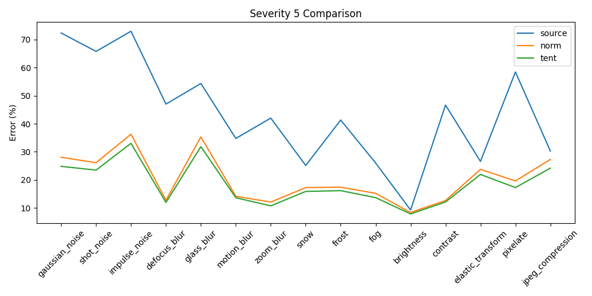
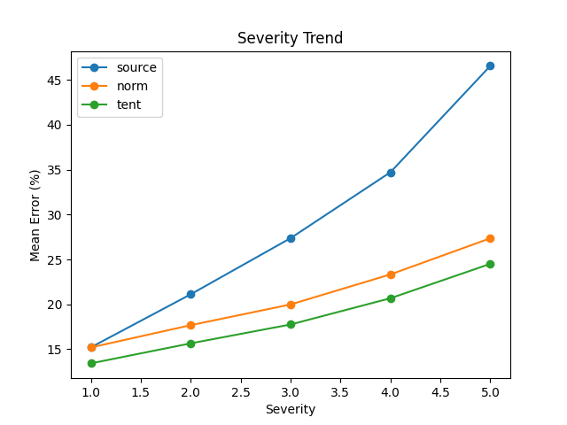
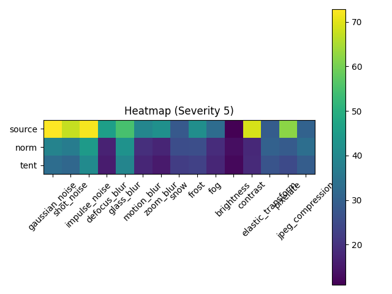
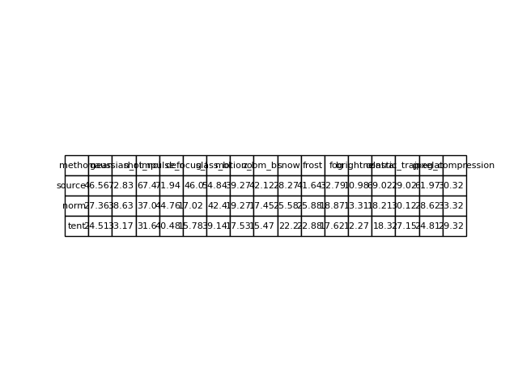

# ⛺️ Tent: Fully Test-Time Adaptation by Entropy Minimization

This is a minimal reimplementation of the [Tent](https://openreview.net/forum?id=uXl3bZLkr3c) method for fully test-time adaptation by entropy minimization.

**Installation**:

```
pip install -r requirements.txt
```

Install Cifar 10C from this [link](https://zenodo.org/records/2535967/files/CIFAR-10-C.tar?download=1) ; 
Unzip CIFAR-10-C.tar and place under data/

```bash
cd data/
tar -xvf CIFAR-10-C.tar
```

TENT depends on

- Python 3.9

and the example depends on

- [RobustBench](https://github.com/RobustBench/robustbench) v0.1 for the dataset and pre-trained model
- [yacs](https://github.com/rbgirshick/yacs) for experiment configuration

## Example: Adapting to Image Corruptions on CIFAR-10-C

The official repository contains examples that adapts a CIFAR-10 classifier to image corruptions on CIFAR-10-C.

This example compares a baseline without adaptation (source), test-time normalization for updating feature statistics during testing (norm), and our method for entropy minimization during testing (tent).
The dataset is [CIFAR-10-C](https://github.com/hendrycks/robustness/), with 15 types and 5 levels of corruption.

### WRN-28-10
The default model for [RobustBench](https://github.com/RobustBench/robustbench).

**Usage**:

```python
python cifar10c.py --cfg cfgs/source.yaml
python cifar10c.py --cfg cfgs/norm.yaml
python cifar10c.py --cfg cfgs/tent.yaml
python plots_tent.py
```

**Result**: tent reduces the error (%) across corruption types at the most severe level of corruption (level 5).

## Comparison of Results between Original and Reimplementation
### Results from My Reimplementation







